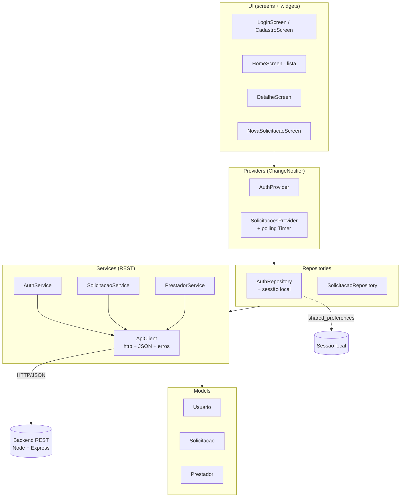

# Arquitetura do App Cliente – Clean Architecture

O aplicativo segue uma organização em camadas inspirada na **Clean Architecture**
(MARTIN, 2019), com dependências apontando sempre "para dentro": a UI conhece os
providers, que conhecem os repositórios, que conhecem os serviços — e nunca o
contrário. Cada camada tem uma responsabilidade única e pode ser testada/trocada
isoladamente.

## Diagrama de camadas



## Responsabilidades por camada

| Camada           | Pasta              | Responsabilidade |
|------------------|--------------------|------------------|
| **Models**       | `models/`          | Entidades de domínio e (de)serialização JSON (`fromJson`). Sem lógica de UI nem de rede. |
| **Services**     | `services/`        | Comunicação com a API REST. `ApiClient` é a única classe que conhece o pacote `http`; os serviços por domínio expõem métodos de alto nível. |
| **Repositories** | `repositories/`    | Ponto único de acesso a dados para os providers. Combinam serviços com outras fontes (ex.: `AuthRepository` persiste a sessão em `shared_preferences`). |
| **Providers**    | `providers/`       | Estado da aplicação (`ChangeNotifier`). Expõem dados e ações à UI e notificam mudanças. `SolicitacoesProvider` contém o **polling** de atualização assíncrona. |
| **Screens**      | `screens/`         | Telas; apenas observam providers e disparam ações. |
| **Widgets**      | `widgets/`         | Componentes visuais reutilizáveis (cards, badges, estados vazios). |
| **Core**         | `core/`            | Configuração (URL/intervalo), tema e utilitários transversais. |

## Fluxo de uma ação (ex.: criar solicitação)

```
NovaSolicitacaoScreen
   → SolicitacoesProvider.criar()
      → SolicitacaoRepository.criar()
         → SolicitacaoService.criar()
            → ApiClient.post('/solicitacoes')  → Backend REST
```

## Fluxo da atualização assíncrona (Sprint 3)

```
SolicitacoesProvider.iniciarPolling()
   └── Timer.periodic(5s) → atualizarSilencioso()
          → SolicitacaoRepository.listar()
             → SolicitacaoService.listarPorUsuario()
                → GET /solicitacoes?usuario_id=...
   └── se houver mudança de status → notifyListeners() → UI atualiza
```

Quando o **prestador** (app da Sprint 4) altera o status no backend, o evento é
publicado no **MOM (RabbitMQ)** e persistido. O app do cliente, ao fazer o
próximo polling, percebe a mudança e atualiza a tela automaticamente.

## Referência

MARTIN, Robert C. *Arquitetura limpa: o guia do artesão para estrutura e design
de software.* Rio de Janeiro: Alta Books, 2019.
